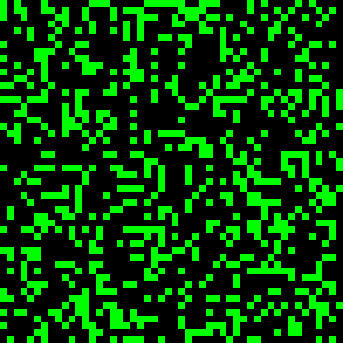
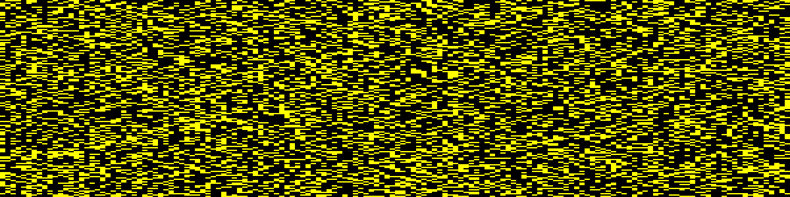

# Conway's Game

John Horton Conway sadly passed away on April, 11, 2020. Among so many
contributions he also conceived the Game of Life ---here denoted as Conway's
Game

This Go package is a personal tribute to his memory


## Installation

To install the `conway-game` package execute:

``` sh
$ go get github.com/clinaresl/conway-game
```

and a directory called `github.com/clinaresl/conway-game` will be created under
the `src/` folder of your `$GOPATH`.

To compile the program go to `$GOPATH/src/github.com/clinaresl/conway-game` and
type:

``` sh
$ go build
```

and the executable `conway-game` will be generated. You can test it with:

``` sh
$ ./conway-game --version
```

To access the documentation of this package run `godoc`:

```sh
$ godoc -http "localhost:8080"
```

and access to the URL `localhost:8080` with your favourite browser (hopefully
[Firefox](https://www.mozilla.org/en-US/firefox/new/))


## Usage

`conway-game` provides various functionalities for generating animated GIF
images which are stored in the file specified with `--filename`. It randomly
locates an arbitrary number of living cells (specified with `--population`) over
a grid of dimensions *width* and *height* (which are specified with the flags
`--width` and `--height` respectively) and applies the rules of the Game of Life
(*Conway's Game*) for the number of **generations** given in `--generations`,
described in the
[Wikipedia](https://en.wikipedia.org/wiki/Conway%27s_Game_of_Life) as follows:

1. Any live cell with fewer than two live neighbours dies, as if by
   *underpopulation*.
2. Any live cell with two or three live neighbours lives on to the next
   generation.
3. Any live cell with more than three live neighbours dies, as if by
   *overpopulation*.
4. Any dead cell with exactly three live neighbours becomes a live cell, as if
   by *reproduction*.

It also provides the following functionalities:

* It is possible to specify the delay between frames (with `--delay`), and also
  the delay of the first frame (`--delay0`), so that the first one can become
  visible any amount of time.
  
* By default, each cell takes a pixel of the GIF image. It is possible, however,
  to apply any *x*/*y* aspect ratio to the image with `--xratio`/`--yratio`,
  which are not expected to be necessarily the same.

* It acknowledges various *color models* through `--model`. To get a complete
  overview of the different colour models use `--help-model`.

* Finally, to give a sense of *evolution*, it is also feasible to compute the
  average of colors of the same cell over an arbitrary number of consecutive
  generations with `--average`.


## Examples

A number of examples of the different functionalities provided by this tiny
package are given below

### Aspect ratio

The most basic of all examples is given below:

``` sh
./conway-game --filename test.gif --generations 100 --width 50 --height 50 
              --population 720 --xratio 10 --yratio 10 
              --model "gradient #000000:#00ff00:#00ff00"
```

which produces an old-fashioned image with big pixels, live cells shown in green
and the background in black:



As an example of the possibility of modifying the aspect ratio, the following
command:

```sh
./conway-game --filename test.gif --generations 300 --width 150 --height 150 
              --population 7500 --xratio 8 --yratio 2 
              --model "gradient #000000:#ffff00:#ffff00"
```

modifies the aspect ratio so that cells are four times wider:



### *Gradient* color model

Just by making the color of the first generation equal to the background and
using a different color for the last frame, it is possible to create a *fade-in*
effect with the color model *gradient*:

```sh
./conway-game --filename test.gif --generations 300 --width 300 --height 300 
             --population 25000 --xratio 2 --yratio 2 
             --model "gradient #000044:#000044:#ff0000"
```


Conversely, it is also possible to create a *fade-out* effect under the same
color model just by inverting the second and third color as follows:

```sh
./conway-game --filename test.gif --generations 300 --width 300 --height 300 
             --population 25000 --xratio 2 --yratio 2 
             --model "gradient #000044:#ff0000:#000044"
```


But it is of course fine to move gradually between any arbitrary combinations of
red, green and blue as shown below:

```sh
./conway-game --filename test.gif --generations 300 --width 300 --height 300 
              --population 25000 --xratio 2 --yratio 2 
              --model "gradient #000033:#ff0000:#ffff00"
```


### *Radial* color model

The radial color model assigns a color to each cell according to its distance to
a given center with a comma-separated list of coordinates in `--model` after the
combination of colors. The following example colors those cells near the right
center of the grid with colors closer to the second one, and cells far from it
get colors closer to the third:

```sh
./conway-game --filename test.gif --generations 300 --width 300 --height 300 
              --population 10000 --xratio 2 --yratio 2 
              --model "radial #002222:#ff0000:#008888;150,150"
```


Of course, the center can be placed anywhere on the grid:

```sh
./conway-game --filename test.gif --generations 300 --width 300 --height 300 
              --population 10000 --xratio 2 --yratio 2 
              --model "radial #000000:#ffffff:#000044;100,150"
```


# License #

`conway-game` is free software: you can redistribute it and/or modify it under
the terms of the GNU General Public License as published by the Free Software
Foundation, either version 3 of the License, or (at your option) any later
version.

`conway-game` is distributed in the hope that it will be useful, but WITHOUT ANY
WARRANTY; without even the implied warranty of MERCHANTABILITY or FITNESS FOR A
PARTICULAR PURPOSE. See the GNU General Public License for more details.

You should have received a copy of the GNU General Public License along with
`conway-game`. If not, see <http://www.gnu.org/licenses/>.


# Author #

Carlos Linares Lopez <carlos.linares@uc3m.es>
